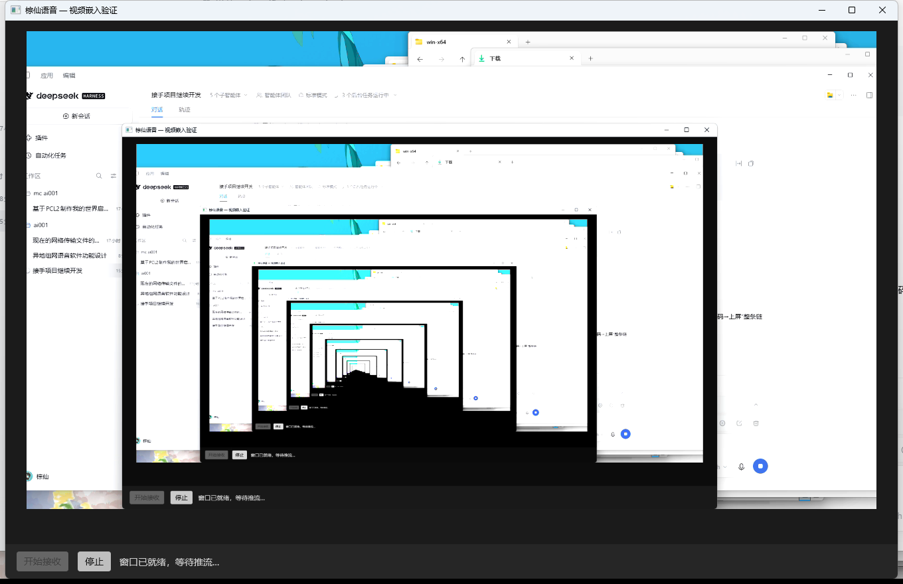
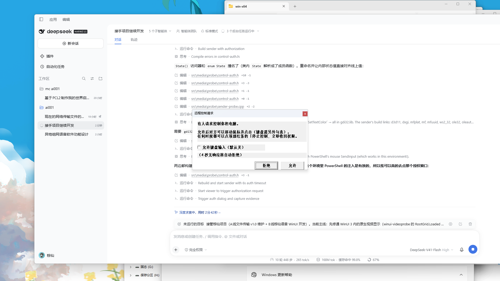

# 同频（SameFreq）

**不用租服务器、不用开会员，就能和朋友一起语音 —— 而且可以只把某一个应用的声音分享给对方。**

Discord / TeamSpeak / KOOK / YY 这类软件，要么**得先有个服务器**，要么**把关键功能锁进会员**。
这里的做法是反过来：**建房那个人的电脑就是服务器**，其他人直接连他。
语音、画面、文件全部点对点、端到端加密，**不经过任何第三方**。

> 图标与美术素材归作者所有（见「许可」一节）。

## 那些要付费/装插件的，这里是什么样

| 别的软件 | 这里 |
|---|---|
| 租服务器 / 买语音频道 | **一个人建房就行** —— 他的电脑就是信令服务器，其余人局域网自动发现或粘一串邀请码加入 |
| **只把某个游戏 / 播放器的声音传给对方**（而不是整机混音） | **按应用独立共享** ⭐：真实枚举系统里**正在发声的应用**，挑一个单独推给对方；也能选"整个系统" |
| 高清语音 + 降噪 | Opus 48 kbps 起步，**三档降噪**（关 / 标准 / 强）+ 静音，**免费** |
| 屏幕共享 | 整个屏幕 / 单个窗口 |
| 发文件 | 点对点直传，不经服务器；收到后可直接打开文件或所在文件夹 |
| 看网络状况 | 实时显示延迟 / 丢包 / 抖动 / 码率 / 链路类型（局域网直连 or 中继） |

## 先说清楚现状（免得你踩坑）

这是个**早期版本**，功能已经能跑通，但**稳定性还在打磨** ——
尤其是同机多开、跨运营商网络这些边角场景，可能会遇到连不上或需要重试的情况。

它主打的方向是「**不花服务器钱也能用上核心功能**」，**不是**「比 Discord 更稳」。
如果你要的是稳定商用级体验，现在还不是时候；如果你愿意折腾、并且正好想要
"**只共享某个应用的声音**"这种被锁进会员的功能，那这个项目就是为你写的。

bug 和需求都欢迎提 [issue](https://github.com/zongxian1218-del/zongxian-voice/issues)。

<details>
<summary><b>English</b></summary>

**SameFreq** — voice chat with friends **without renting a server and without a subscription**,
including **per-application audio sharing**: pick one running app (a game, a media player) and send
only *its* audio to your friends, instead of the whole system mix.

Whoever creates the room **becomes the server** (signaling runs inside the app);
everyone else joins over LAN or via a virtual LAN such as Tailscale / Radmin VPN.
Voice, screen sharing, per-app audio and file transfer are peer-to-peer and end-to-end encrypted.
Built with C# / WinUI 3 + WebView2 plus a small C++ audio engine (WASAPI, incl. Windows
process-loopback for per-app capture). Licensed MIT (code); artwork excluded.

**Status: early.** Features work, stability is still being improved — expect rough edges,
especially with multiple instances on one machine or across carrier networks.

</details>

---

## 能做什么


| 功能 | 说明 |
|---|---|
| **语音房** | 一端建房（本机即信令服务器），其他人**局域网自动发现**或粘邀请串加入；房间可改名、删除 |
| **多人语音** | WebRTC 点对点，Opus 48 kbps 起步；**三档降噪**（关 / 标准 / 强），支持静音；用户可自选麦克风与扬声器 |
| **屏幕共享** | 共享整个屏幕 / 单个窗口，对方画面在应用内显示 |
| **按应用共享声音** ⭐ | **可以只共享某一个应用的声音**（游戏 / 播放器 / 浏览器），也可以选整个系统。列表是真实枚举出来的（`IAudioSessionManager2`），不是写死的清单。和屏幕共享**互相独立**，可以只推声音不推画面 |
| **文件传输** | 断点走数据通道直传；收到后可直接「打开文件 / 打开所在文件夹」 |
| **文字聊天** | 房间里直接聊，不经服务器 |
| **连接质量** | 实时显示延迟、丢包、抖动、码率、链路类型（局域网直连 / 中继） |

## 截图

| 主界面（语音房 + 成员栏） | 首次加入（授权与设备选择） |
|---|---|
|  |  |

## 快速开始

1. 到 [Releases](https://github.com/zongxian1218-del/zongxian-voice/releases) 下载最新的
   `同频-测试版-vNN.zip`，解压到任意目录（**不要放进需要管理员权限的目录**）。
2. 双击 `ZongxianVoice.exe`。首次启动 Windows 会问麦克风权限，允许即可。
3. 一端点「新建 / 加入房间」→ 给房间起个名字 → **建房**。
4. 另一端：同一局域网下会自动出现这个房间，点一下就能加入；
   不在同一网段时，把房主界面上的**邀请串**发给对方，粘进「方式二」即可。

> 跨网使用：双方都装一个免费组网工具（Tailscale / Radmin VPN），进同一个虚拟局域网，
> 程序会自动识别组网地址 —— 效果等同于局域网。

## 构建

**前置**（Windows 10/11）：

| 依赖 | 用途 |
|---|---|
| .NET 8 SDK | 构建 C# / WinUI 3 主程序 |
| Visual Studio 2022（含「使用 C++ 的桌面开发」） | 构建 C++ 音频引擎（`zxprobe.exe`） |
| Node.js（可选） | 跑页面模块的语法/加载检查 |
| WebView2 Runtime | 运行时依赖（Win11 自带，Win10 需安装） |

**步骤**（在仓库根目录）：

```cmd
build\build-media.cmd        :: 1) 构建 C++ 音频引擎
build\build-winui-cs.cmd     :: 2) 构建主程序
build\release.py --version NN  :: 3) 跑完全部自动检查并打包（唯一发版入口）
```

`build\release.py` 会依次执行 **45 项自动闸门**（见下），全绿才产出 zip。

## 架构

```
页面（WebView2 内的 HTML/JS，15 个模块）
   ▲  事件（页面 → C#）        │  命令（C# → 页面）
   └──────── 桥 BridgeContract.cs（唯一契约登记处，启动时双向对账） ────────┘
C# 宿主（WinUI 3）：VoiceModule / ChatModule / FileModule /
                    ShareAudioModule / ScreenModule + 基础设施
   ▲  采集 / 播放
C++ 引擎（zxprobe.exe）：只提供三种原语 —— 设备与会话枚举、采集流、播放
```

两条规矩：**命令与事件只能走桥**（模块之间不许直接调用）；**契约只有一个登记处**
（`BridgeContract.cs`），启动时自动对账，漏登记会被守卫拦住。

## 质量保证（45 项自动闸门）

这个项目把「修好了」定义成**机器可复核**，而不是"看起来没问题"：

- **构建类**：两个产物能构建、`resources.pri` 存在、媒体资源与探针版本一致；
- **契约类**：C# ↔ 页面双向对账（调用漏登记、事件没人接都会被拦）；
- **界面类**：模拟键鼠启动 → 进主界面 → 打开设置，控件必须在屏幕内；
- **端到端（双实例真跑）**：文字收发、语音通话（麦克风轨 + 双向字节）、
  挂断两端同步、静音往返、再次加入、共享电脑声音（真实音频能量）、屏幕共享（帧计数）、
  用户真实流程（改名 → 删房间 → 建房 → 搜索加入）、信令断开自动重连；
- **卫生类**：`dist/` 不许有陈旧产物、包里不许夹带配置/日志/测试残留。

跑法：`python build\run-checks.py`（发版前由 `release.py` 自动执行）。

## 已知限制

- **只在 Windows 上打包与实测**（macOS / Linux 未适配）；
- **同一台电脑上多个实例同时共享屏幕会失败**（Windows 对同一采集源互斥），
  此时再点一次「共享屏幕」会提示原因；
- 屏幕共享与语音都依赖 P2P 连通性：双方都在运营商大内网（CGNAT）且没有组网工具时，
  只能靠 STUN 打洞，成功率取决于 NAT 类型 —— 这种情况下**建议先组网**；
- 异地速度上限永远是**发送方上行带宽**，换什么软件都一样。

## 许可与第三方

- **代码**：MIT（见 [LICENSE](LICENSE)）。
- **美术素材**（图标、角色形象）：归作者所有，**不在 MIT 授权范围内**。
- 第三方组件及其许可见 [THIRD-PARTY-NOTICES.md](THIRD-PARTY-NOTICES.md)。

欢迎提 issue / PR —— 想参与请看 [CONTRIBUTING.md](CONTRIBUTING.md)。
