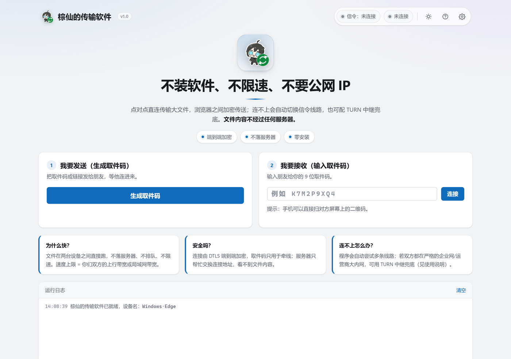
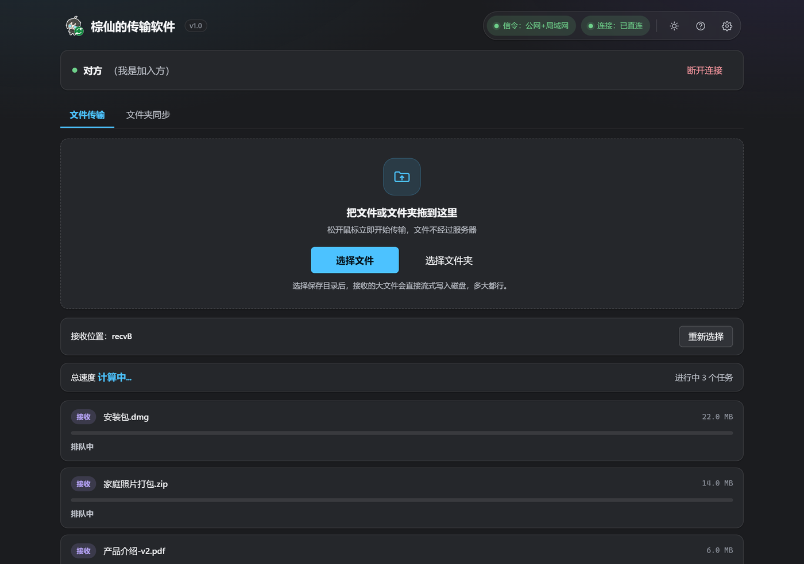

# 棕仙的传输软件（Zongxian Transfer）

朋友之间传大文件的工具：**不装服务器、不要公网 IP、不限速、无广告**。
三种形态任选：**网页版单文件**（发给朋友双击就能用）、**Windows 桌面版**（局域网最快 + 文件夹同步）、**手机浏览器**（同一 WiFi 或异地组网下直接用）。

> 名字来自作者的角色「棕仙」。图标/角色形象归作者所有。
> **这是一个欢迎改进的开源项目** —— 想参与请看 [CONTRIBUTING.md](CONTRIBUTING.md)（里面列了最需要帮助的方向）。

<details>
<summary><b>English</b></summary>

**Zongxian Transfer** — a no-server, no-public-IP, unlimited-speed file transfer tool for sending large files to friends.
Three forms: a **single-file web app** (just send the HTML file), a **Windows desktop app** (fastest on LAN via multi-stream TCP + folder sync), and **any phone browser** (same Wi-Fi, or over a virtual LAN such as Tailscale/Radmin VPN).
Built with the Python standard library only (desktop side) and dependency-free classic scripts (web side).
Peer-to-peer over WebRTC with hand-rolled MQTT signaling for the web app; multi-stream TCP with resumable 4 MB SHA-256 chunks for the desktop app.
**Contributions welcome** — see [CONTRIBUTING.md](CONTRIBUTING.md). Licensed MIT (code), artwork excluded.

</details>


---

## 能做什么

| 场景 | 怎么用 | 实测速度 |
|---|---|---|
| 两台电脑在同一个 WiFi | 桌面版 `send` / `recv`，或图形界面点两下 | **~145 MB/s**（200MB / 4 流实测，2026-10-05） |
| 电脑 ↔ 手机（同一 WiFi） | 电脑跑 `webapp`，手机扫码打开网页版 | 受 WiFi 限制，一般 5~20 MB/s |
| 异地（不同城市/不同宽带） | 见下面「异地传输」一节 | 2~10 MB/s（**上限 = 发送方上行带宽**） |
| 文件夹自动同步 | 桌面版「同步目录」+ 可选开机自启 | 局域网满速 |
| 超大文件/断网重来 | 自动**断点续传**（4MB 块 + SHA-256 校验） | — |

速度参考（都是本机实测，不是宣传数字）：桌面版 200MB 4 流 **145.5 MB/s**（2026-10-05 复测，`tests/test_lan.py` 6/6 通过）；浏览器 P2P 回环 **~27 MB/s**；400 个小文件 **~3 s**。

---

## 截图

| 网页版（浅色） | 网页版（深色，已连接+传输中+诊断） |
|---|---|
|  |  |


---

## 快速开始

### 1) 网页版（零安装，最适合发给朋友）
把 `swiftdrop.html` 用微信/QQ 发给对方，两边**各自双击打开**，然后：
- 一方点「生成取件码」→ 把 9 位码发给对方；
- 另一方在「我要接收」里**输入这 9 位码**，点「连接」。

> 注意：`file://` 直接打开时，页面里的"链接/二维码"指向的是你自己硬盘，对别人无效——
> 所以**要发的是 9 位取件码**（或让对方也打开同一份 html）。页面会自动识别这种情况并提示。

### 2) Windows 桌面版
下载 Release 里的 `棕仙的传输软件-自解压版.exe`（双击→选目录→解压即用），或 `zongxian-portable-win64.zip`（解压后双击 exe）。

```
棕仙的传输软件.exe peers                     # 发现局域网设备
棕仙的传输软件.exe recv --dir D:\收件          # 接收端
棕仙的传输软件.exe send <设备名或IP> <文件>    # 发送端（--streams 6 提高跨网吞吐）
棕仙的传输软件.exe sync <设备名或IP> D:\同步目录 --watch
棕仙的传输软件.exe webapp                     # 跨网传输：打开内置网页版
棕仙的传输软件.exe group                      # 看异地组网地址
```

### 3) 手机
- **同一 WiFi**：电脑跑 `webapp`，界面里会给出局域网地址和二维码，手机扫码即可。
- **异地**：见下。

---

## 异地传输（重要，先看这段）

**物理事实**：双方都在运营商大内网（CGNAT）后面时，**没有任何软件能凭空直连**——必须有第三方牵线。
所以本项目的策略是：

1. **首选：装一个免费组网工具**，把两台设备放进同一个虚拟局域网，然后本软件就用局域网那套多流 TCP 直传
   （**不需要打洞、不需要公网 IP、不需要中继服务器**，成功率 100%）：
   - [Tailscale](https://tailscale.com/download) —— 全平台（Windows/安卓/iOS/macOS/Linux），WireGuard 直连，手机要参与时选它；
   - [Radmin VPN](https://www.radmin-vpn.com/cn/) —— 仅 Windows，国内速度快、配置极简；
   - [ZeroTier](https://www.zerotier.com/download/) —— 全平台，需要 Network ID。

   装好后运行 `棕仙的传输软件.exe group`，就能看到组网地址；把它给对方（或点界面里的「复制局域网地址」/看内置网页版里的二维码）即可。

2. **备选**：手机开热点给电脑连（瞬间变成局域网）。
3. **网页版还内置了公共信令 + NAT 打洞**（WebRTC）：一边是全锥形 NAT 时能直连，双方都是 CGNAT 时打不通，会在界面上直接给提示和解决办法。

⚠️ **异地速度的上限永远是"发送方的上行带宽"**，组网只解决"连得上、连得稳、能跑满管道"：

| 发送方 | 现实速率 |
|---|---|
| 家宽上行 100 Mbps | ~10 MB/s |
| 家宽上行 20~30 Mbps（很常见） | 2~4 MB/s |
| 手机 4G/5G | 0.5~2.5 MB/s |
| 浏览器 WebRTC 单流（丢包链路） | 曾实测 30~60 KB/s |

程序会**按到目标的建连延迟自动提高并发流数**（局域网 4 条，跨网最多 8 条）来吃满带宽。

---

## 从源码跑 / 构建

只依赖 **Python 3.10+ 标准库**（桌面版/服务端），网页版是单文件 HTML，无任何 CDN/第三方 JS。

```bash
# 跑桌面版（源码方式）
set PYTHONPATH=src
python -m swiftdrop gui          # 图形界面
python -m swiftdrop group        # 异地组网地址
python -m swiftdrop webhost      # 局域网网页服务 + 信令中继
python -m swiftdrop webapp       # 跨网传输：内置网页版窗口

# 构建网页版单文件（把 js/css 内联进 dist/swiftdrop.html）
python build/build-web.py

# 跑测试
python build/run-checks.py       # 冒烟检查：14 项 = 3 构建 + 界面自检前置 --no-click + 界面自检（模拟键鼠）
                                 #        + 8 条守卫（pri / dist 卫生 / 媒体·探针一致性 / 脚本名字绑定
                                 #          / 残留规则 / 界面控件名 / RELEASES 表格结构 / cmd 行尾）
                                 #        + 传输层 6 阶段；release 模式同为 14 项
python build/verify-desktop.py   # 桌面版端到端 5/5（128MB 校验、续传、同步、/signal）
python tests/test_lan.py         # 局域网/中继/webhost 6 项（2026-10-05 复测 6/6 通过）
python build/verify-diag.py      # 连接诊断面板实测

# 仓库已启用 git（本机 git 全路径 D:\BuildTools\MinGit\cmd\git.exe；HEAD 见 git log），改动前想要一个临时回滚点也可以跑这个（见 docs/versioning-and-checks-2026-10-05.md）
python build/snapshot.py

# 打 Windows 包（需要 PyInstaller；见 build/）
python build/build-exe.py        # 生成 dist/棕仙的传输软件/ 与 便携 zip
python build/make-sfx.py         # 自解压版 exe（NSIS）
python build/make-installer.py   # 传统安装包（NSIS）
```

网页版的浏览器端测（Playwright + 本机 Edge）：

```bash
node build/e2e/e2e.mjs           # 8/8：建连、32MB 校验、中文/emoji、400 文件、续传、双向同步、反向
node build/e2e/lan-e2e.mjs       # 纯局域网信令建连 + 诊断面板
```

---

## 目录结构

```
src/web/           网页版（单文件 HTML 的源码：util/qr/signaling/rtc/transfer/sync/relay/app + index + style）
src/swiftdrop/     桌面版与服务端（纯标准库）
  ├─ transfer.py   局域网多流 TCP 传输引擎（断点续传、SHA-256 分块校验）
  ├─ discovery.py  UDP 广播发现
  ├─ sync.py       三向状态目录同步
  ├─ webhost.py    局域网静态服务 + /signal 信令中继（+ Range、路径穿越防护）
  ├─ netgroup.py   异地组网网卡识别（Radmin/Tailscale/ZeroTier/Hamachi）
  ├─ webview.py    用系统 Edge/Chrome 打开内置网页版
  ├─ cli.py gui.py 命令行与图形界面
  └─ foldericon.py 同步文件夹自动换图标、autostart.py 开机自启
src/relay/         可选的中继服务器（打洞失败时回退，AES-GCM 加密）
build/             构建脚本（build-web / build-exe / make-sfx / make-installer）、e2e 测试
tests/             单元与端到端测试
```

---

## 技术要点

- **传输**：局域网走 N 条并行 TCP（默认 4，跨网自动升到最多 8），8MB 分片、4MB 块 SHA-256 校验、只对缺失块补齐（断点续传）。
- **网页版 P2P**：自带一套极简 MQTT 3.1.1 over WebSocket 客户端（多个公共 broker + 同源 `/signal` 中继双通道），WebRTC 数据通道传输，DTLS 端到端加密，服务器只帮忙牵线。
- **性能调优记录**：发送缓冲上限 12MB（浏览器数据通道硬上限约 16MB）、背压等待 15ms 上限、接收端只在整文件结束 fsync 一次（避免每片 fsync 把吞吐压到磁盘同步速度）。
- **诊断**：「连接诊断」面板用 `getStats()` 的真实值（选中候选对类型/RTT/可用带宽/字节数）+ 发送管道"憋住"统计，直接给出"慢在哪"的结论（上行瓶颈 / 链路丢包 / 中继受限 / 接收方磁盘）。

---

## 已知限制（如实写）

- **双方都是 CGNAT 时纯 P2P 打不通**：这是物理限制，不是 bug。用组网工具（首选）、手机热点，或自建中继。
- **异地速度受发送方上行限制**，任何软件都突破不了。
- **安卓客户端已停止维护**：安卓 WebView 里连境外公共信令服务器常被网络环境拦掉，体验不可控；手机建议用浏览器 + 组网/同 WiFi。仓库不包含安卓签名私钥。
- 中继服务器（`src/relay/`）需要你自备一台有公网 IP 的机器。
- 目前只在 Windows 上打包与实测（桌面版代码是跨平台标准库，未做 macOS/Linux 适配与验证）。

---

## 参与改进 / 贡献

这个项目还很年轻，**任何帮助都有用**：报 bug、提需求、改文档、改代码、翻译。

- **想改代码**：看 [CONTRIBUTING.md](CONTRIBUTING.md)（含开发环境、测试命令、PR 规范、以及**最需要帮助的方向**：中继一键部署、macOS/Linux 适配、浏览器端多流、英文界面……）。
- **想报问题**：开 [Issue](https://github.com/) 时请附上**「连接诊断」面板里「复制诊断信息」的整段文本**——里面有链路类型、RTT、抖动、速度、卡顿和结论，能省掉大量来回猜测。
- **提交前**请至少跑通：`python build/verify-desktop.py`（5/5）、`node build/e2e/e2e.mjs`（8/8）。

## 许可

- **代码**：MIT License（见 [LICENSE](LICENSE)）——可以自由使用、修改、分发、商用，只要保留版权声明。
  *（`LICENSE` 里的版权人名字会在上传时自动填成你的 GitHub 用户名。）*
- **美术资源**：「棕仙」角色形象与图标（`dist/*.ico`、`dist/icons/*`）为作者作品，**不在 MIT 范围内**，未经许可请勿商用；Fork 自用请自行替换图标。

