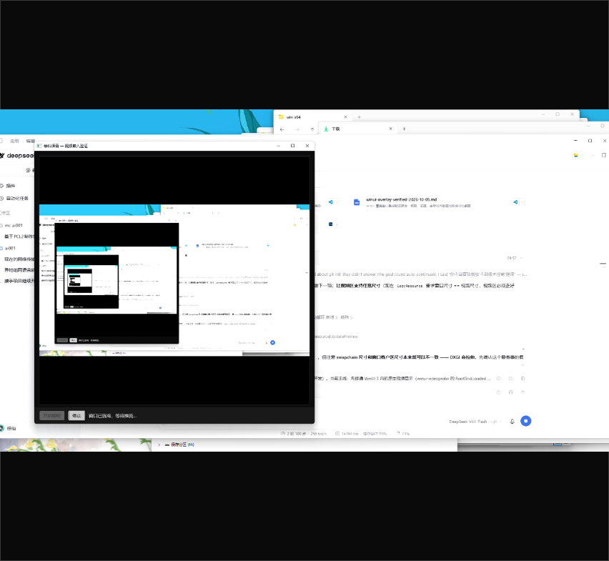

# 视频区支持任意尺寸（2026-10-05 第三轮）

## 结论

视频区**不再要求正好等于视频分辨率**（原来是写死的 1280x720）。
现在：视频区跟随窗口任意伸缩，画面按流宽高比在区内**居中（letterbox）**，不变形。
实测 1312x738 与 852x479 两种尺寸都正确，帧率与延迟无回退。

---

## 关键发现：不需要写缩放代码，DXGI 本来就会拉伸

原设计里 `D3D11WindowRenderer` 用 `CopyResource` 上屏，要求后台缓冲与源纹理同尺寸，
于是**窗口尺寸被迫等于视频尺寸**。交接文档据此建议"改用 `ID3D11VideoProcessor` 做 BGRA→BGRA 缩放"。

但 **swapchain 缓冲尺寸与窗口客户区尺寸本来就是解耦的**：
`CreateSwapChainForHwnd` 的 `DXGI_SWAP_CHAIN_DESC1` 在代码里是 `sd{}` 零初始化，
`Scaling` 取默认值 `DXGI_SCALING_STRETCH` —— **DXGI 会把后台缓冲拉伸到窗口客户区**。

所以只要"只改窗口尺寸、不动 swapchain"，就得到任意尺寸显示，**渲染端一行没改**。
先验证假设再动手，省掉了整套 VideoProcessor + 输入/输出视图 + Blit 的代码和驱动兼容风险
（这也修正了交接文档里那条建议）。

代价与对策：
- 缩放由 DXGI/DWM 做线性过滤，不是"最锐"的；需要更锐可以以后再上 VideoProcessor 或着色器。
- 比例不匹配时会被**拉伸变形**，所以由应用侧算出 letterbox 矩形（见下），保证宽高比。

---

## 改动

| 文件 | 改动 |
|---|---|
| `src/media/probe/receiver-probe.cpp` | stdin 协议 `rect x y` → `rect x y [w h]`（向后兼容）；带宽高时同时 `SetWindowPos` 改窗口尺寸（**不动 swapchain**）；每次调整记一行日志便于对照 |
| `src/winui-videoprobe/src/MainWindow.xaml` | 视频区由 `Center/Top` 固定尺寸改为 `Stretch` 填满 |
| `src/winui-videoprobe/src/MainWindow.xaml.cs` | 删掉写死的 1280x720；新增 `DisplayRectScreen()` 按流宽高比在视频区内居中算显示矩形（屏幕物理像素）；`SendRect()` 发 4 个数字；诊断文件改为每次调整都刷新（`WriteDiag`） |

`DisplayRectScreen()` 的算法：设视频区可用尺寸 `availW×availH`、流宽高比 `aspect`，
先取 `w=availW, h=availW/aspect`；若 `h>availH` 则反过来取 `h=availH, w=availH*aspect`；
再在区内居中。这样覆盖窗口永远等于"内接最大同比例矩形"。

---

## 实测

### 默认窗口 1360x880

| 项 | 值 |
|---|---|
| 视频区实际 | 1312x765 |
| 显示矩形 | **1312x738**（16:9 且纵向居中：1312/1.7778 = 738） |
| 抓图 | mean 211.79 / 非黑 90.4% |

### 方形窗口 900x900（决定性测试，非 16:9）

| 项 | 值 |
|---|---|
| 视频区实际 | 852x785 |
| 显示矩形 | **852x479**（正好 16:9：852/1.7778 = 479） |
| 显示矩形抓图 | mean 192.60 / 非黑 81.8% |
| 整个视频区抓图 | mean 121.58 / 非黑 **50.3%**、黑 49.7% |

**letterbox 的定量自洽**：视频占视频区面积 479/785 = 61.0%，画面本身非黑率 81.8%，
预期整体非黑 = 61.0% × 81.8% = **49.9%**，实测 **50.3%**（差 0.4 个百分点）。
说明：画面被完整放在居中的 16:9 矩形里、矩形外是纯黑、没有铺满也没有变形。



### 助手日志：三次 `rect` 全部落地

```
[信息] 窗口实际矩形 屏幕(50,87)-(1330,807)  1280x720      ← 初始 = 视频尺寸
[信息] rect 命令：窗口 -> (50,87)-(1362,825)  1312x738     ← 应用按显示区纠正
[信息] rect 命令：窗口 -> (124,161)-(1436,899)  1312x738    ← 窗口移动跟随
[信息] rect 命令：窗口 -> (124,300)-(976,779)  852x479      ← 方形窗口后 letterbox 重算
```

### 帧统计（无回退）

```
[22.2 秒] 收包 13599  已重组帧 670  已解码 630  本秒解码 30  解码延迟 4 ms
```

30fps 稳定、解码延迟 1~4ms。重组比解码多 40 帧，是启动期非 IDR 帧被丢：
18.1 秒与 22.2 秒两处采样差值都是 40、**不随时间增长**，不是积压。

---

## 还没做的

1. **流宽高比仍写死 16:9**（`StreamW/StreamH` 默认 1280x720）。
   真实应用里应由助手在解码器就绪时上报 `event stream-size W H`，应用据此重算 letterbox ——
   否则非 16:9 的流会被拉变形。现在 720p/1080p/1440p 都是 16:9，所以还没暴露。
2. 应用**最小化时覆盖窗口没有跟随隐藏**（移动/尺寸已同步）。
3. **点击穿透 / 拦截**未做。

---

*相关：`winui-overlay-verified-2026-10-05.md`（第二轮：WinUI 内显示打通）、`handoff-next-session.md`（已同步）。*
