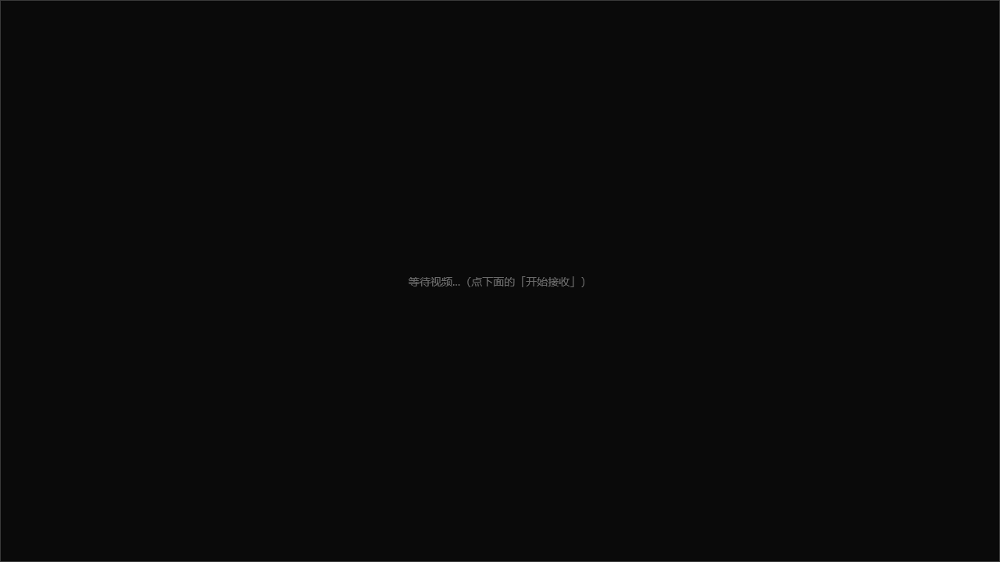

# WinUI 覆盖窗口集成：已通过（2026-10-05 第二轮）

## 结论

**自研媒体链路的画面已经能在 WinUI 3 应用里正常显示。**
上一轮"集成未验证通过"的结论**已推翻**：不是架构问题（无边框顶层覆盖窗口这条路是对的），
而是**两处各自的实现疏漏**，都已修复并有一段 44 秒连续运行的实测记录。

`winui-integration-status-2026-10-05.md` 里"下一轮要做的第 1 项"（怀疑 `RootGrid.Loaded` 没触发）
**是误判**，原因见下。

---

## 上一轮的结论错在哪

上一轮的记录是：助手侧窗口创建成功、数据也收到了，但截图里视频区仍是黑的；
且 `%TEMP%\videoprobe-pos.txt` 没生成 → 于是判定"`RootGrid.Loaded` 里的自动启动没有执行"。

事实是：

1. **诊断文件写在 `%TEMP%`，而本机环境下被拉起的子进程写不进 `%TEMP%`**（对照实验见下），
   加上 C# 侧写的是空 `catch { }`，失败被静默吞掉 —— 文件缺失被误读成"那段代码没执行"。
2. **真正让画面黑掉的是：`--frameless` 覆盖窗口从来没有被显示出来。** 它与 `Loaded` 毫无关系。

实测反证：本轮诊断文件改成 exe 同级后，`Loaded` **正常触发**，助手被正常拉起
（`event view-ready` 与后续 908 帧解码都是它跑起来的）。

---

## 修复 1：`--frameless` 分支漏了"显示"和"置顶"

文件：`src/media/probe/receiver-probe.cpp` → `CreatePreviewWindow()`

| | 普通顶层窗口分支 | `--frameless` 分支（修复前） |
|---|---|---|
| 窗口样式 | `WS_OVERLAPPED \| WS_CAPTION \| WS_SYSMENU \| ...` | `WS_POPUP`（**不含 `WS_VISIBLE`**） |
| 显示 | `ShowWindow(hwnd, SW_SHOWNORMAL)` | **无** |
| 置顶 | `SetWindowPos(topmost ? HWND_TOPMOST : HWND_TOP, ... SWP_SHOWWINDOW)` | **无**（`topmost` 参数被整个忽略） |

`WS_POPUP` 本身不带 `WS_VISIBLE`，所以窗口建出来就是隐藏的；而这条分支既没 `ShowWindow`
也没 `SetWindowPos`，`--topmost` 也没落到扩展样式上。

**修复前**的 Win32 实测（`EnumWindows` + `GetWindowRect` + `GetWindowLong`）：

```
z#10  pid=52316  hwnd=0x004B20AE  vis=False  rect=(196,203)-(1476,923)  1280x720  topmost=False  toolwin=True
z#11  pid=40764  hwnd=0x00732A0A  vis=True   rect=(156,156)-(1516,1036) 1360x880
```

窗口矩形**完全正确**（与父应用算出的视频区一致），但 `IsWindowVisible=False`、`WS_EX_TOPMOST` 也没设上。
所以现象就是"助手在正常收包解码，屏幕上却什么都没有"。

**修法**：`--frameless` 分支补齐与普通分支同一套动作 ——
`ShowWindow(SW_SHOWNOACTIVATE)` + `UpdateWindow` +
`SetWindowPos(topmost ? HWND_TOPMOST : HWND_TOP, ..., SWP_SHOWWINDOW)`。

**修复后**同一位置实测：

```
z#9   pid=46268  hwnd=0x00381C30  vis=True   rect=(248,255)-(1528,975)  1280x720  topmost=True   class='ZxPreviewWnd'
z#11  pid=53196  hwnd=0x001F0E30  vis=True   rect=(208,208)-(1568,1088) 1360x880  class='WinUIDesktopWin32WindowClass'
```

---

## 修复 2：诊断文件从 `%TEMP%` 改到 exe 同级

文件：`src/winui-videoprobe/src/MainWindow.xaml.cs`
`%TEMP%\videoprobe-pos.txt` → exe 同级 `videoprobe-pos.txt`，并把空 `catch { }` 改成把失败显示到状态栏。

### 为什么要改：对照实验（同一份 exe，只换输出路径）

| 输出路径 | 结果 |
|---|---|
| `%TEMP%\zxsend-a.h264`（工作区外） | ❌ `[X] 无法创建输出文件`，exit 1 |
| `D:\文档\ai001\tmp\send-b.h264`（工作区内、中文路径） | ✅ 60 帧 / 1 612 736 B，exit 0 |
| `%USERPROFILE%\zxsend-e.h264`（工作区外、非 TEMP） | ❌ `[X] 无法创建输出文件`，exit 1 |
| 同一路径改用 pwsh / cmd 写入 | ✅ 成功 |

**结论**：既不是中文路径的问题，也不是"子进程一律不能写 Temp"，而是
**这些被拉起的 exe 只能写工作区内的路径**，工作区外写入会失败。
规则：探针与被拉起的子进程，输出与日志一律写工作区内（exe 同级，或项目 `tmp/`）。

---

## 实测证据（44 秒连续运行）

### 1) 坐标对齐（两边完全一致）

```
C# 侧   videoprobe-pos.txt : areaScreen=248,255  rasterScale=1  videoAreaActual=1280x720
助手侧  receiver-probe-log : [信息] 窗口实际矩形 屏幕(248,255)-(1528,975)  1280x720
```

### 2) 帧统计（助手日志）

```
[20.1 秒] 收包 3982   已重组帧 185  已解码 185  本秒解码 31  解码延迟 2 ms
[30.2 秒] 收包 10266  已重组帧 486  已解码 486  本秒解码 30  解码延迟 2 ms
[44.2 秒] 收包 19448  已重组帧 908  已解码 908  本秒解码 30  解码延迟 3 ms
```

平均 30 fps、解码延迟 2~6 ms、无丢帧/分片不齐报错。

### 3) 截图（亮度统计是客观判据）

| 修复前（同一坐标抓图） | 修复后（同一坐标抓图） |
|---|---|
|  |  |
| mean=10.30 stddev=4.16 nonblack=0.6%<br>（10.30 正是 XAML 视频区背景 `#FF0A0A0A`，说明看到的是应用自己的黑底） | mean=171.73 stddev=106.28 nonblack=88.3%（真实画面） |

第二张是应用窗口全貌（1360x880）：视频区已被实时画面填满。
画面里的"套娃"是正常的 —— 发送端采集的是整张桌面，而桌面里又包含应用窗口与覆盖窗口本身。

---

## 本次验证方法（可复用）

```powershell
# 1) 发送端（后台任务）
sender-probe.exe 90 D:\文档\ai001\tmp\run-screen.h264 1280 720 30 6000000 --send 127.0.0.1 41001 --local 41000
# 2) 应用（后台任务，会自动拉起助手）
VideoProbe.exe
# 3) 客观判据：按 C# 诊断文件里的 areaScreen 坐标抓图 + 亮度统计
python build\grab-region.py <x> <y> <w> <h> tmp\shot.png
# 4) 窗口状态（z 序 / 可见性 / 置顶 / 矩形）
powershell build\inspect-windows.ps1
```

注意：`inspect-windows.ps1` 需要 `Set-ExecutionPolicy -Scope Process -ExecutionPolicy Bypass`，
且脚本内的进程过滤要用 `-match`（`Get-Process -Name 'a','b'` 在脚本里实测取不到，原因未查）。

---

## 还没做的（下一轮）

1. ~~**视频区尺寸必须正好 1280x720**~~ → **已解决（第三轮）**：**不需要** VideoProcessor。
   协议改成 `rect x y w h`、缩放交给 DXGI（`DXGI_SCALING_STRETCH`）、应用侧按流宽高比算 letterbox。
   见 `video-area-arbitrary-size-2026-10-05.md`。
2. **应用最小化时覆盖窗口没有跟随隐藏**（移动/尺寸已通过 `rect x y w h` 同步，最小化还没处理）。
3. **点击穿透 / 拦截**：覆盖窗口会吃掉鼠标事件。做远程控制时这是需要的，但要区分本地操作与远程注入。
4. **应用状态栏不刷新解码帧数**：助手 stdout 的中文与 C# 端按 UTF-8 匹配疑似对不上
   （`view-ready` 这类 ASCII 事件能匹配上）。小缺陷，未深查。
5. **搬进正式应用 `src/winui-cs/`**：把 WebView2 媒体替换成 C++ 助手进程，只换 `d3d11-renderer.h` 那一层。

---

## 后续（2026-10-05 晚）：frameless 覆盖窗口的 `WS_EX_TOPMOST` **没设上** —— 回归

第二轮记的"可见性已打通（`vis=True topmost=True`）"**只对非 frameless 的顶层窗口成立**。
今天复测发现：**应用实际用的 frameless 覆盖窗口拿不到 TOPMOST**。

### 测量（判定方式与 `build/inspect-windows.ps1` 一致：`GetWindowLong(-20)` 的 `WS_EX_TOPMOST` 位）

| 启动参数 | exStyle | TOPMOST |
|---|---|---|
| `--window --topmost`（非 frameless 顶层窗口） | `0x00000108` | ✅ **True** |
| `--window --frameless --topmost`（**应用用的就是这个**） | `0x08000080`（TOOLWINDOW\|NOACTIVATE） | ❌ **False** |

助手自己的日志（这行就是为定位它临时加的）把话说死了：

```
[信息] 覆盖窗口置顶: WS_EX_TOPMOST 设置失败（首次 SetWindowPos 后=未带，补设后=未带）
```

即：`topmost` 确实为真、`SetWindowPos(HWND_TOPMOST, …)` 调用后位没置上；
**连显式 `SetWindowLongPtr(GWL_EXSTYLE, … | WS_EX_TOPMOST)` 再置顶一次，读回仍是未带**。

### 后果（实测到了）

覆盖窗口随时会被别的窗口盖住。本轮做 P1-6 验收截图时，画面区正好被一个
"Windows 远程协助"窗口盖住 —— 截出来是那个窗口而不是视频。

### 未解决（本轮把可疑原因逐个排除了，但根因仍未隔离）

**排除掉的（都有实测）：**

| 假设 | 实验 | 结论 |
|---|---|---|
| `WS_EX_NOACTIVATE` / `WS_POPUP` 挡住置顶 | `build/topmost-selftest.cpp` 把窗口样式拆成 9 个变体（含与覆盖窗口完全同款的 `WS_POPUP + TOOLWINDOW\|NOACTIVATE`） | ❌ 全部 **能** 置顶（exStyle 变 `0x08000088`） |
| 调用序列（不带 WS_VISIBLE 创建 + `SW_SHOWNOACTIVATE` + `UpdateWindow` + `SWP_SHOWWINDOW`） | 变体 G/H/I 完全照探针写法（含同样的自定义 WndProc） | ❌ 全部 **能** 置顶 |
| harness 对后台拉起进程的限制 | 同一个对照程序在**后台任务**里再跑一遍 | ❌ 依然全部 **能** 置顶 |
| 这个进程不会置顶 | 同一个 `receiver-probe.exe` 用 `--window --topmost`（非 frameless） | ❌ 那个窗口 **能** 置顶（`0x00000108`） |
| 延迟一下就好 | 探针消息泵里重试 3 次（每次读回写日志） | ❌ 3 次都是"仍未生效"，exStyle 始终 `0x08000080` |

**结论**：既不是窗口样式、也不是调用序列、也不是进程上下文或"这个进程不会置顶"。
**根因尚未隔离** —— 差别只剩"探针这个具体窗口/进程状态"这一小块。

**2026-10-05 晚补充证据（两实例联调，见 `p1-6-native-video-in-main-app-2026-10-05.md`）**：
同一次运行、同一份代码、同一台机器 ——
A（房主）的覆盖窗口 3 次重试**全失败**（`exStyle=0x08000080`），
B（加入方）的覆盖窗口**首次 `SetWindowPos` 就带上了 TOPMOST**（`exStyle=0x08000088`）。

**而且这个规律在三次独立联调里完全一致（房主 4/4 失败、加入方 4/4 成功）**：

| 运行 | 端（角色） | 该端助手的置顶结果 |
|---|---|---|
| 联调 1 | A **房主**（`--selftest-host`） | ❌ 失败 ×3 |
| 联调 1 | B 加入（`--selftest-join`） | ✅ **成功**（首次即带） |
| 联调 2 | A **房主** | ❌ 失败 ×3（两个生命周期都失败） |
| 联调 2 | B 加入 | ✅ **成功**（两个生命周期都成功） |
| 联调 3 | H **房主**（普通房主 + `--screen-cycle`） | ❌ 失败 ×3 |
| 联调 3 | Y 加入（普通加入 + 观看） | ✅ **成功**（首次即带） |
| 联调 3 | X 加入（**在对方开始共享之后才加入**） | —（本端根本没进观看状态，见下） |

→ 所以它**不是随机时序，而是和应用实例的角色相关**：房主总是失败、加入方总是成功。
而且**它本来就能成功**，不是本机被永久禁止。

**"启动顺序"这个变量还没被干净地验掉**：联调 3 本来是想用"两个角色相同的加入方"来判定
（先起的失败＝顺序问题，都成功＝房主角色问题），但后起的那个实例**中途加入，收不到
`remote-screen-started`**（那是页面里一次性发出的事件，没有补发），所以它压根没进观看状态、
没起助手 —— 试验没做成。这个"中途加入看不到正在进行的共享"本身是个**真实产品缺口**，
记在 `p1-6-native-video-in-main-app-2026-10-05.md` 里，它需要动媒体引擎（多人共享架构），
属于要先定设计的那一类。

**下一步（明确的实验，不是猜）**：在探针进程里**同时**创建一个"朴素同伴窗口"（DefWindowProc +
变体 A 样式）和预览窗口，两者都尝试置顶并各记一行日志：

- 两个都失败 → 是进程/线程状态（D3D 设备、CoInitializeEx 等初始化）影响的，再往那边缩；
- 只有预览窗口失败 → 是这个窗口自身的属性，用 `GetWindowLongPtrW(GWL_STYLE/GWL_EXSTYLE)`、
  `GetWindowRect`、`IsWindowVisible`、`GetWindow(hwnd, GW_OWNER)` 逐项与同伴窗口对比。

**这次的补丁不是修复**：它只是把失败写进日志并重试 3 次（仍失败）。别当成已修好。

### 对产品的影响与临时结论- 覆盖窗口**不置顶**意味着它能被任何前台/置顶窗口盖住（实测被"Windows 远程协助"盖过）。
- 但**正常使用场景下它仍然在应用窗口之上**（同属非置顶带时，后创建的在上），所以"视频显示"这个主功能不受影响；
  受影响的是"任何别的窗口盖过来时视频会消失"。
- 真正该做的设计动作是：让覆盖窗口稳定待在**自己应用窗口之上**（`SetWindowPos(hwnd, appHwnd, …)`
  插到应用窗口正上方），而不是追求"盖住所有窗口"。这需要应用把主窗口 hwnd 告诉助手 —— 留给下一步。

---

*相关：`handoff-next-session.md`（已同步更新）、`winui-integration-status-2026-10-05.md`（上一轮记录，其"下一轮第 1 项"已作废）、`render-path-verified-2026-10-05.md`（D3D11 上屏单测）。*
